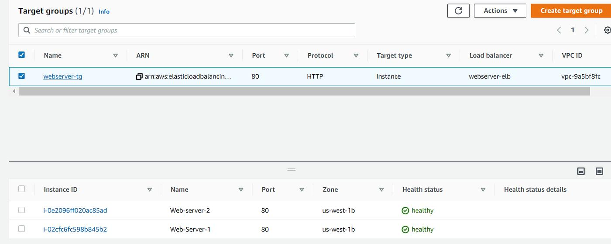
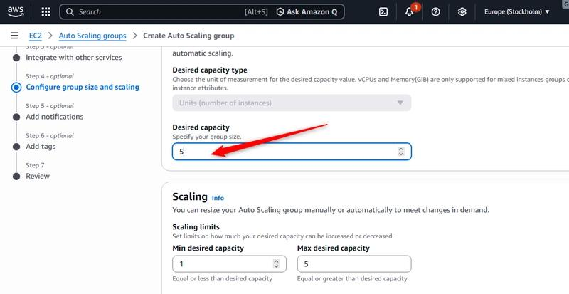
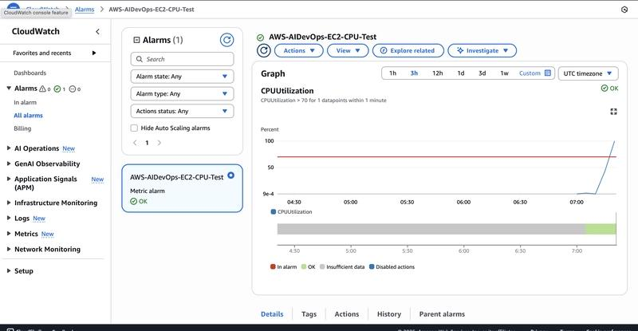

<div align="center">

# ☁️ AWS Auto Scaling Web Application

### Highly Available & Scalable AWS Web Infrastructure using Terraform

<p>
  
  
  
  
  
  
</p>

<p>
  <strong>Production-Style AWS Cloud Architecture</strong><br>
  VPC • EC2 • ALB • Auto Scaling • CloudWatch • Terraform • Linux
</p>

<br>

<br><br>
[](https://github.com/krish12242005/aws-auto-scaling-web-app)

</div>

---

# 📌 Project Overview

**AWS Auto Scaling Web Application** is a highly available and scalable web application infrastructure built on **Amazon Web Services** using **Terraform Infrastructure as Code**.

The architecture is designed around a multi-AZ AWS networking model where internet traffic enters through an **Application Load Balancer**, which distributes requests across healthy **Amazon EC2** instances running **Apache HTTP Server**.

The EC2 instances are managed by an **Auto Scaling Group**, while **Amazon CloudWatch** provides CPU utilization monitoring.

This project demonstrates practical implementation of:

* ☁️ AWS Cloud Infrastructure
* 🌐 VPC Networking
* 🔄 EC2 Auto Scaling
* ⚖️ Application Load Balancing
* 📊 CloudWatch Monitoring
* 🔐 Security Groups
* 🏗️ Terraform Infrastructure as Code
* 🐧 Linux Administration
* 🌍 Apache Web Server
* 🧪 AWS CLI Verification

---

# 🏗️ Architecture

```text
                              🌐 INTERNET
                                   │
                                   ▼
                    ┌───────────────────────────┐
                    │  Application Load         │
                    │       Balancer (ALB)      │
                    │         HTTP : 80         │
                    │      Internet-Facing      │
                    └─────────────┬─────────────┘
                                  │
                                  ▼
                    ┌───────────────────────────┐
                    │       Target Group        │
                    │         HTTP : 80         │
                    │      Health Check : 80    │
                    └─────────────┬─────────────┘
                                  │
                       ┌──────────┴──────────┐
                       │                     │
                       ▼                     ▼
                ┌──────────────┐      ┌──────────────┐
                │    EC2 #1    │      │    EC2 #2    │
                │ Amazon Linux │      │ Amazon Linux │
                │    Apache    │      │    Apache    │
                │   HTTP : 80  │      │   HTTP : 80  │
                └──────┬───────┘      └──────┬───────┘
                       │                     │
                       └──────────┬──────────┘
                                  │
                                  ▼
                    ┌───────────────────────────┐
                    │     Auto Scaling Group    │
                    │                           │
                    │ Minimum Capacity : 2      │
                    │ Desired Capacity : 2      │
                    │ Maximum Capacity : 4      │
                    └─────────────┬─────────────┘
                                  │
                                  ▼
                    ┌───────────────────────────┐
                    │        CloudWatch         │
                    │     CPU Utilization       │
                    │       Threshold : 70%     │
                    └───────────────────────────┘
```

---

# 🖼️ Architecture Diagram

<div align="center">


</div>

---

# ☁️ AWS Services

| AWS Service                         | Purpose                                              |
| ----------------------------------- | ---------------------------------------------------- |
| **Amazon VPC**                      | Provides isolated networking for the application     |
| **Amazon EC2**                      | Runs the Apache web application                      |
| **Application Load Balancer**       | Distributes incoming HTTP traffic                    |
| **Target Group**                    | Registers EC2 targets and performs health checks     |
| **Auto Scaling Group**              | Maintains and scales EC2 capacity                    |
| **Amazon CloudWatch**               | Monitors EC2 CPU utilization                         |
| **Internet Gateway**                | Provides internet connectivity to public resources   |
| **NAT Gateway**                     | Provides outbound connectivity for private resources |
| **Security Groups**                 | Controls network traffic                             |
| **Systems Manager Parameter Store** | Provides centralized parameter storage               |

---

# 🛠️ Technology Stack

## ☁️ Cloud

<p>


</p>

## 🏗️ Infrastructure as Code

<p>

</p>

## 🐧 Operating System & Web Server

<p>


</p>

## 🔧 DevOps & Tools

<p>


</p>

---

# 🌐 Network Architecture

The infrastructure follows a **multi-AZ VPC architecture** designed for availability, controlled network access, and secure application communication.

## Public Subnets

Public subnets are used for internet-facing infrastructure.

Resources include:

* Application Load Balancer
* NAT Gateway
* Internet Gateway connectivity

## Private Subnets

Private subnets are used for application workloads.

Resources include:

* EC2 instances
* Auto Scaling Group
* Apache web servers

The EC2 application servers are not intended to be directly exposed to the public internet.

## Internet Gateway

The Internet Gateway provides internet connectivity for public subnet resources.

## NAT Gateway

The NAT Gateway provides outbound internet connectivity for private subnet resources without requiring direct inbound internet access.

## Route Tables

Separate routing is used to control traffic between public and private subnets.

## Multi-AZ Architecture

The EC2 instances are distributed across Availability Zones to improve application availability and provide fault tolerance.

---

# ⚖️ Application Load Balancer

The Application Load Balancer acts as the public entry point for the application.

### ALB Configuration

| Configuration | Value                          |
| ------------- | ------------------------------ |
| Name          | `aws-auto-scaling-web-app-alb` |
| Type          | Application Load Balancer      |
| Scheme        | Internet-facing                |
| Protocol      | HTTP                           |
| Port          | `80`                           |
| State         | Active                         |

### Traffic Flow

```text
Internet
   ↓
Application Load Balancer
   ↓
Target Group
   ↓
Healthy EC2 Instances
   ↓
Apache HTTP Server
   ↓
HTML Response
```

---

# 🎯 Target Group

The Target Group connects the Application Load Balancer with the EC2 application instances.

| Configuration         | Value                         |
| --------------------- | ----------------------------- |
| Name                  | `aws-auto-scaling-web-app-tg` |
| Protocol              | HTTP                          |
| Port                  | `80`                          |
| Health Check Protocol | HTTP                          |
| Health Check Port     | `80`                          |

The Target Group performs health checks and routes application traffic only to healthy targets.

### Verified Target Health

```text
Target 1 : healthy
Target 2 : healthy
```

---

# 🔄 Auto Scaling Group

The application uses an EC2 Auto Scaling Group to maintain application availability and manage compute capacity.

| Configuration      |                          Value |
| ------------------ | -----------------------------: |
| Auto Scaling Group | `aws-auto-scaling-web-app-asg` |
| Minimum Capacity   |                              2 |
| Desired Capacity   |                              2 |
| Maximum Capacity   |                              4 |

### Auto Scaling Benefits

* High availability
* Automatic instance replacement
* Fault recovery
* Capacity management
* Horizontal scaling
* Multi-AZ deployment
* Improved application reliability

---

# 📊 CloudWatch Monitoring

Amazon CloudWatch provides monitoring visibility for EC2 CPU utilization.

### High CPU Alarm

| Configuration      | Value                               |
| ------------------ | ----------------------------------- |
| Alarm Name         | `aws-auto-scaling-web-app-high-cpu` |
| Metric             | `CPUUtilization`                    |
| Namespace          | `AWS/EC2`                           |
| Statistic          | Average                             |
| Period             | 60 seconds                          |
| Evaluation Periods | 2                                   |
| Threshold          | 70%                                 |

The alarm monitors CPU utilization and provides visibility into high resource usage.

---

# 💻 Web Application

The EC2 instances run **Apache HTTP Server on Amazon Linux**.

### Application Output

```text
AWS Auto Scaling Web App

Instance is running successfully!

Managed by Auto Scaling Group + ALB
```

### Application Verification

```text
HTTP/1.1 200 OK
Server: Apache/2.4.68 (Amazon Linux)
Content-Type: text/html
```

---

# 🔐 Security Architecture

Security Groups are used to control communication between the Application Load Balancer and EC2 instances.

## ALB Security Group

```text
Protocol : TCP
Port     : 80
Source   : 0.0.0.0/0
```

The internet-facing ALB accepts HTTP requests from the internet.

## EC2 Security Group

The EC2 security group is designed to allow application traffic from the ALB security group rather than exposing the application servers directly to the internet.

### Security Principles

* Public subnets for internet-facing infrastructure
* Private subnets for application workloads
* ALB as the public application entry point
* Security Groups for traffic control
* NAT Gateway for private subnet outbound connectivity
* No direct public application access to private EC2 instances
* Least-privilege security group rules

> **Note:** This project currently uses HTTP on port 80. HTTPS/SSL is not claimed as part of the current implementation.

---

# 📈 Scaling Behavior

### Normal Capacity

```text
EC2 #1
EC2 #2
```

### Increased Workload

```text
EC2 #1
EC2 #2
EC2 #3
```

### Maximum Capacity

```text
EC2 #1
EC2 #2
EC2 #3
EC2 #4
```

The Auto Scaling Group is configured with:

```text
Minimum : 2
Desired : 2
Maximum : 4
```

This allows the environment to maintain a baseline of two instances while supporting additional EC2 capacity when scaling conditions are met.

---

# 🔄 Application Request Flow

```text
                    USER REQUEST
                         │
                         ▼
                     INTERNET
                         │
                         ▼
              APPLICATION LOAD
                  BALANCER
                         │
                         ▼
                  TARGET GROUP
                         │
                 ┌───────┴───────┐
                 ▼               ▼
              EC2 #1           EC2 #2
                 │               │
                 ▼               ▼
              Apache           Apache
                 │               │
                 └───────┬───────┘
                         ▼
                   HTML RESPONSE
```

---

# 🧩 Infrastructure as Code

The complete infrastructure is managed using **Terraform**.

Terraform provisions and manages:

* VPC
* Public Subnets
* Private Subnets
* Route Tables
* Internet Gateway
* NAT Gateway
* Security Groups
* EC2 Launch Template
* Application Load Balancer
* Target Group
* Auto Scaling Group
* CloudWatch Alarm

### Terraform Benefits

* Repeatable infrastructure deployment
* Version-controlled infrastructure
* Consistent environments
* Automated provisioning
* Easier maintenance
* Infrastructure reproducibility

---

# 📁 Project Structure

```text
aws-auto-scaling-web-app/
│
├── app/
│   └── index.html
│
├── assets/
│   └── aws-auto-scaling-architecture.png
│
├── screenshots/
│   ├── target-group-healthy.jpg
│   ├── auto-scaling-group.jpg
│   └── cloudwatch-monitoring.jpg
│
├── scripts/
│
├── terraform/
│   ├── alb.tf
│   ├── autoscaling.tf
│   ├── cloudwatch.tf
│   ├── launch-template.tf
│   ├── main.tf
│   ├── outputs.tf
│   ├── provider.tf
│   ├── security-groups.tf
│   ├── variables.tf
│   └── .terraform.lock.hcl
│
├── .gitignore
└── README.md
```

---

# 📸 Project Screenshots

## 🟢 Target Group — Healthy Instances

Both application targets were verified as healthy in the Application Load Balancer Target Group.

<div align="center">



</div>

---

## 🔄 Auto Scaling Group

The Auto Scaling Group is configured with:

```text
Minimum : 2
Desired : 2
Maximum : 4
```

<div align="center">



</div>

---

## 📊 CloudWatch Monitoring

CloudWatch provides CPU utilization monitoring with a configured high CPU threshold of 70%.

<div align="center">



</div>

---

# 🚀 Deployment

## 1. Clone Repository

```bash
git clone https://github.com/krish12242005/aws-auto-scaling-web-app.git
cd aws-auto-scaling-web-app
```

## 2. Configure AWS CLI

```bash
aws configure
```

Verify the AWS identity:

```bash
aws sts get-caller-identity
```

## 3. Navigate to Terraform

```bash
cd terraform
```

## 4. Initialize Terraform

```bash
terraform init
```

## 5. Validate Configuration

```bash
terraform validate
```

Expected result:

```text
Success! The configuration is valid.
```

## 6. Review Infrastructure

```bash
terraform plan
```

Review the infrastructure changes before deployment.

## 7. Deploy Infrastructure

```bash
terraform apply
```

Confirm with:

```text
yes
```

## 8. Get Application Load Balancer DNS

```bash
terraform output alb_dns_name
```

Open the returned ALB DNS name:

```text
http://<ALB-DNS-NAME>
```

---

# 🔍 Infrastructure Verification

## Check Auto Scaling Group

### PowerShell

```powershell
aws autoscaling describe-auto-scaling-groups `
  --auto-scaling-group-names aws-auto-scaling-web-app-asg `
  --region ap-south-1
```

## Check Target Health

```powershell
aws elbv2 describe-target-health `
  --target-group-arn "<TARGET_GROUP_ARN>" `
  --region ap-south-1
```

## Check Load Balancer

```powershell
aws elbv2 describe-load-balancers `
  --names aws-auto-scaling-web-app-alb `
  --region ap-south-1
```

## Test Application

```powershell
curl.exe -I http://<ALB-DNS-NAME>
```

Expected response:

```text
HTTP/1.1 200 OK
```

---

# 🧪 Verification Checklist

* [x] VPC deployed
* [x] Public subnets configured
* [x] Private subnets configured
* [x] Internet Gateway configured
* [x] NAT Gateway configured
* [x] Application Load Balancer active
* [x] Target Group configured
* [x] EC2 targets verified healthy
* [x] Auto Scaling Group configured
* [x] CloudWatch monitoring configured
* [x] Apache web server running
* [x] HTTP 200 response verified
* [x] Terraform infrastructure deployed
* [x] AWS CLI verification completed

---

# 🎯 Key Learning Outcomes

Through this project, I gained hands-on experience with:

* AWS VPC Architecture
* Public and Private Subnet Design
* Multi-AZ Networking
* Internet Gateway
* NAT Gateway
* Route Tables
* Security Groups
* Amazon EC2
* EC2 Launch Templates
* Application Load Balancer
* Target Groups
* EC2 Auto Scaling
* Amazon CloudWatch
* Terraform Infrastructure as Code
* AWS CLI
* Linux Administration
* Apache HTTP Server
* Git
* GitHub
* AWS Infrastructure Troubleshooting

---

# 📌 Project Highlights

<div align="center">

| Capability                 | Implementation            |
| -------------------------- | ------------------------- |
| ☁️ Cloud Platform          | AWS                       |
| 🏗️ Infrastructure as Code | Terraform                 |
| 🌐 Networking              | Amazon VPC                |
| ⚖️ Load Balancing          | Application Load Balancer |
| 🖥️ Compute                | Amazon EC2                |
| 🔄 Auto Scaling            | EC2 Auto Scaling Group    |
| 📊 Monitoring              | Amazon CloudWatch         |
| 🐧 Operating System        | Amazon Linux              |
| 🌍 Web Server              | Apache                    |
| 🔐 Security                | Security Groups           |
| 🌐 Architecture            | Multi-AZ                  |
| 🧪 Verification            | AWS CLI                   |
| 📦 Version Control         | Git + GitHub              |

</div>

---

# 💡 Why This Project Matters

This project demonstrates practical cloud engineering by combining multiple AWS services into a complete application infrastructure rather than using individual AWS services independently.

The architecture combines:

```text
Networking
     +
Compute
     +
Load Balancing
     +
Auto Scaling
     +
Monitoring
     +
Infrastructure as Code
     +
Security
```

This represents a **production-style architecture pattern** commonly used for highly available and scalable web applications.

---

# 🏆 Project Status

<div align="center">

| Component                 | Status        |
| ------------------------- | ------------- |
| Terraform Infrastructure  | ✅ Deployed    |
| Application Load Balancer | ✅ Active      |
| Target Group              | ✅ Healthy     |
| EC2 Instances             | ✅ 2 Running   |
| Auto Scaling Group        | ✅ Enabled     |
| CloudWatch Monitoring     | ✅ Enabled     |
| Apache Web Server         | ✅ Running     |
| Application Test          | ✅ HTTP 200 OK |
| Network Architecture      | ✅ Multi-AZ    |
| Infrastructure Management | ✅ Terraform   |

</div>

---

# 👨‍💻 About the Author

<div align="center">

## Jaikrish

### Junior Cloud Engineer

**AWS Cloud • DevOps • Linux • Networking • Terraform**

Junior Cloud Engineer focused on building and managing reliable cloud infrastructure using AWS, Terraform, Linux, Networking, and DevOps technologies.

<br>


</div>

---

# 🧠 Core Skills

```text
AWS
Terraform
Linux
Networking
Amazon EC2
Amazon VPC
Application Load Balancer
Auto Scaling
CloudWatch
AWS CLI
Git
GitHub
Apache
Infrastructure as Code
```

---

# ⭐ Project Repository

<div align="center">

### 🔗 GitHub Repository

[](https://github.com/krish12242005/aws-auto-scaling-web-app)

<br>

If you found this project useful, consider giving the repository a ⭐

</div>

---

# 🧹 Cleanup

To remove the AWS infrastructure created and managed by Terraform:

```bash
cd terraform
terraform destroy
```

Confirm:

```text
yes
```

> ⚠️ **Warning:** `terraform destroy` removes AWS resources managed by this Terraform project. Review the Terraform plan carefully before confirming.

---

<div align="center">

## ☁️ AWS Auto Scaling Web Application

**Built with AWS + Terraform + Linux + DevOps**

<br>

**Jaikrish — Junior Cloud Engineer**

<br>

[](https://github.com/krish12242005)

</div>
